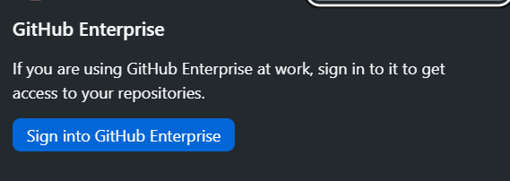
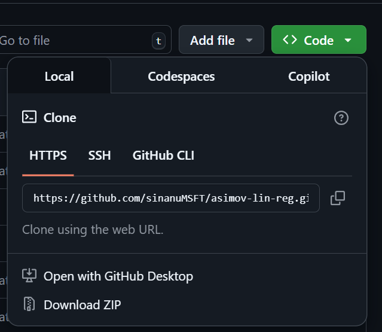
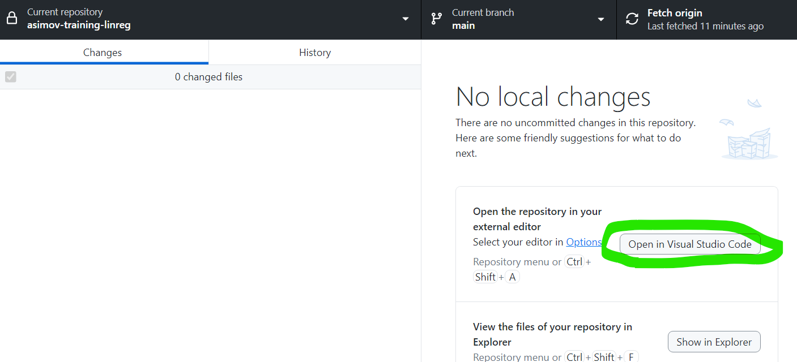
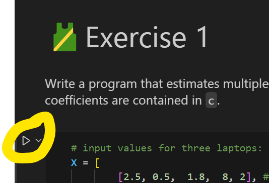

# asimov-lin-reg
A mini linear regression tutorial

## Setup

Setup is super easy will take few hours. 839 steps. I'm probably joking.

1. To clone the repo, you need a Microsoft based GitHub account. To create yours go to [https://github.com/enterprises/microsoft](https://github.com/enterprises/microsoft)
1. [Install GitHub Desktop](https://github.com/apps/desktop) if you never cloned a GitHub project before.

    1. Sign Into GitHub Enterprise using:  

    2. And use [https://github.com/enterprises/microsoft](https://github.com/enterprises/microsoft) to login.

1. Install Python:  [Python from python.org](https://www.python.org/downloads/)

1. [Install Python VSCode Extensions](https://marketplace.visualstudio.com/items?itemName=ms-python.python)

1. [Install Jupyter Extension](https://marketplace.visualstudio.com/items?itemName=ms-toolsai.jupyter)  

1. Open repo in your local VSCode:

    1. Go to: https://github.com/aep-edge-microsoft/asimov-training-linreg
    1. Clone repo using the green Code button and Open with Git Hub Desktop as at the image above.
    1. Once it's cloned, click Open in Visual Studio Code
    
    1. Open Terminal in VSCode by pressing CTRL+Shift+~, switch to PowerShell if needed, create venv:  
`python3 -m venv venv`

    1. Activate venv  
`.\venv\Scripts\activate`

    1. Restore packages:
    `pip install -r .\requirements.txt`

1. Open `open_me.ipynb` Jupyter Notebook

    1. At the right top corner, select `Select Kernel`
    1. Select `Python Environments`
    1. Select the `venv` Python environment you just created.

1. Testing if everything is working
    1. In `open_me.ipynb` click on  execute button at first exercise:
    
    1. VSCode will ask you to install any missing libraries for execution and output `0` at the bottom of that code block.